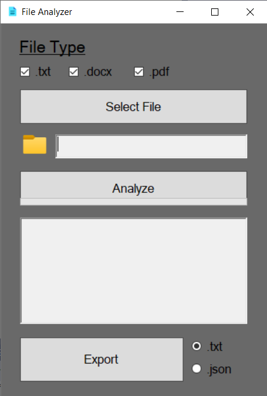
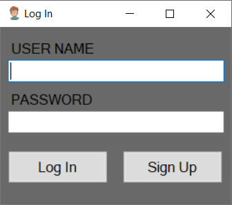

# FileAnalyzer_WinForm

A simple file analysis tool with an optional login system.  
The application allows you to analyze `.txt`, `.docx`, and `.pdf` files, providing detailed statistics such as character count, line count, unique words, repeated words with their frequencies, and punctuation counts.

  

## Features

- **Optional Login/Signup:** Users can log in or skip directly to file analysis.
- **File Selection with Filters:** Choose files with `.txt`, `.docx`, or `.pdf` extensions based on selected checkboxes.
- **Progress Bar:** Displays the progress of file analysis.
- **Detailed Analysis Results:**
  - Character count
  - Line count
  - Unique word count
  - Repeated words and their frequencies
  - Punctuation marks and their frequencies
- **Export Results:** Save analysis results in `.txt` or `.json` formats using radio button selection.

## How It Works

1. Open the application and optionally log in or sign up.
2. Select the desired file format(s) using the checkboxes.
3. Click **Select File** to choose the file.
4. Click **Analyze** to process the file and view the statistics.
5. Click **Export** to save the results in the desired format.

## LogIn SignUp 
  
